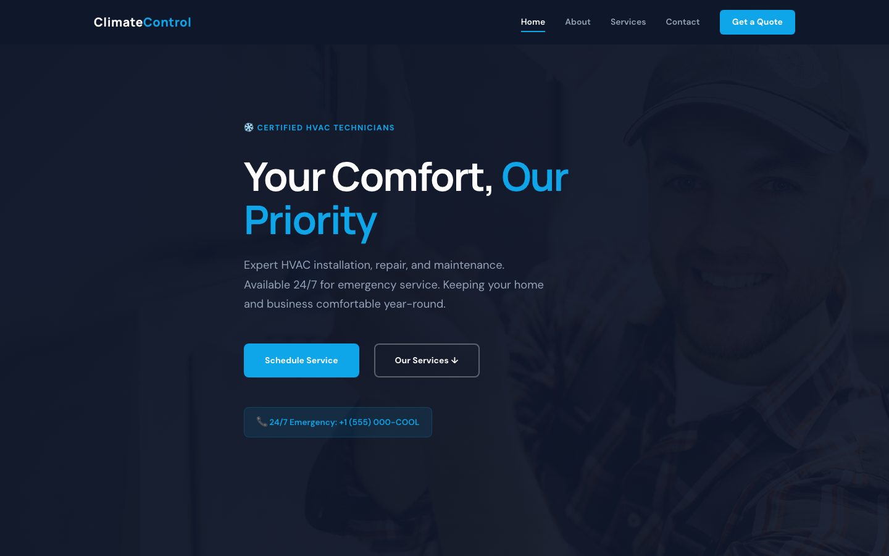

# CLIMATECONTROL — Expert HVAC Services

> **Your Comfort, Our Priority** — Professional HVAC installation, repair, and maintenance. 24/7 emergency service, certified technicians, 100% satisfaction guarantee.

## 🏢 What This Is

A premium, framework-free HTML template for HVAC service companies. Ice blue and cool gray palette, clean modern design, 4 pages covering everything from service overview to emergency scheduling. Built with semantic HTML5, CSS custom properties, and vanilla JavaScript — no dependencies.

## 📄 Pages

| Page | File | Purpose |
|------|------|---------|
| **Home** | [index.html](index.html) | Hero with emergency badge, 3 service cards, about split, stats, differentiators |
| **About** | [about.html](about.html) | Brand story, team profiles, core values, company stats |
| **Services** | [services.html](services.html) | Detailed service breakdowns with alternating layouts (installation, repair, maintenance, commercial) |
| **Contact** | [contact.html](contact.html) | Service request form, emergency contact info, business hours |

## 📸 Screenshot



## 🎨 Design System

| Token | Value | Usage |
|-------|-------|-------|
| `--blue` | `#0EA5E9` | Primary accent, CTAs, highlights |
| `--gray-400` | `#64748B` | Body text, secondary elements |
| `--dark` | `#0F172A` | Dark sections, header, footer |

**Typography:** Manrope (headings) + DM Sans (body) via Google Fonts  
**Layout:** CSS Grid + Flexbox, `clamp()` responsive sizing, `aspect-ratio` media containers

## ⚙️ Key Features

- **24/7 Emergency Badge** — Prominent phone CTA in the hero
- **Alternating Service Rows** — Dark/light sections with side-by-side image + text
- **Blue CTA Banner** — Theme-consistent call-to-action section
- **Contact Form** — Service type dropdown, validation with `.form-ok`/`.form-err`
- **Scroll Reveal** — IntersectionObserver-powered fade-in animations
- **Mobile Responsive** — Burger menu, stacked layouts on small screens
- **Reduced Motion** — Respects `prefers-reduced-motion` system preference

## 📁 File Structure

```
hvac-services-html-template/
├── index.html          # Home page
├── about.html          # About page
├── services.html       # Services detail page
├── contact.html        # Contact / scheduling page
├── README.md           # This file
└── assets/
    ├── css/
    │   └── style.css   # Complete stylesheet (~350 lines)
    ├── js/
    │   └── main.js     # Vanilla JS (~67 lines)
    └── img/
        ├── carousel-1.jpg
        ├── carousel-2.jpg
        ├── about-1.jpg
        ├── about-2.jpg
        ├── about-3.jpg
        ├── about-4.jpg
        ├── feature.jpg
        ├── service-1.jpg
        ├── service-2.jpg
        ├── service-3.jpg
        ├── service-4.jpg
        ├── service-5.jpg
        └── service-6.jpg
```

## 🛠️ Customization

1. **Colors:** Edit CSS custom properties in `:root` — swap `--blue` for your brand color
2. **Fonts:** Change the Google Fonts `<link>` in each HTML file's `<head>`
3. **Images:** Replace files in `assets/img/` — keep same filenames or update references
4. **Content:** Edit HTML directly — all text is inline, no data files
5. **Forms:** Connect `data-form` to your backend or a service like Formspree/Tally

## 🚀 Getting Started

Open any `.html` file in a browser — no build step required. For local development with live reload, use:

```bash
npx serve .
# or
python3 -m http.server 8000
```

---

*Built with ❤️ — Pure HTML, CSS & vanilla JS. Zero dependencies.*
